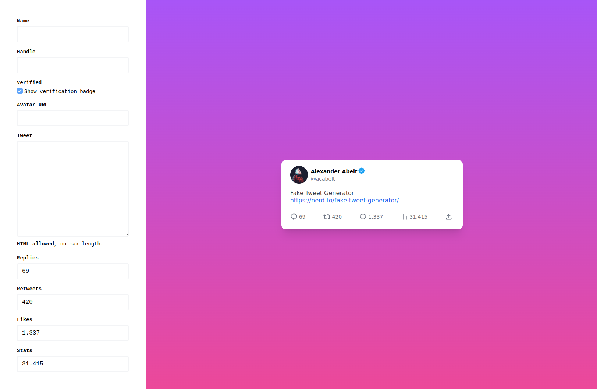

# Tweet Screenshot Generator

The Tweet Screenshot Generator is a handy tool that enables users to create screenshots of tweets with customizable details. With this tool, you can add an avatar, name, handle, reply count, likes count, retweet count, and view stats to simulate a realistic tweet screenshot. Whether you need to create mock-ups for presentations, share screenshots on social media, or simply have some fun, this tool has got you covered.



## Features

- Generate realistic tweet screenshots with custom details.
- Add an avatar to the tweet screenshot.
- Customize the name and handle of the tweet author.
- Display reply count, likes count, retweet count, and view stats.
- Easy-to-use interface with straightforward options.

## Installation

1. Clone the repository:

   ```
   git clone https://github.com/webmanufaktur/fake-tweet-generator.git
   ```

2. Navigate to the project directory:

   ```
   cd fake-tweet-generator
   ```

3. Open index.html in your browser

4. Done.

## Contributing

Contributions are always welcome! If you have any suggestions, bug reports, or feature requests, please open an issue on the [GitHub repository](https://github.com/webmanufaktur/fake-tweet-generator/issues).

If you'd like to contribute to the project, follow these steps:

1. Fork the repository.

2. Create a new branch for your feature or bug fix:

   ```
   git checkout -b your-feature-name
   ```

3. Make your changes and commit them:

   ```
   git commit -m "Add your commit message here"
   ```

4. Push your changes to your forked repository:

   ```
   git push origin your-feature-name
   ```

5. Open a pull request on the main repository.

## License

The Tweet Screenshot Generator is licensed under the [MIT License](https://opensource.org/licenses/MIT). Feel free to modify and distribute the tool as per the license terms.
